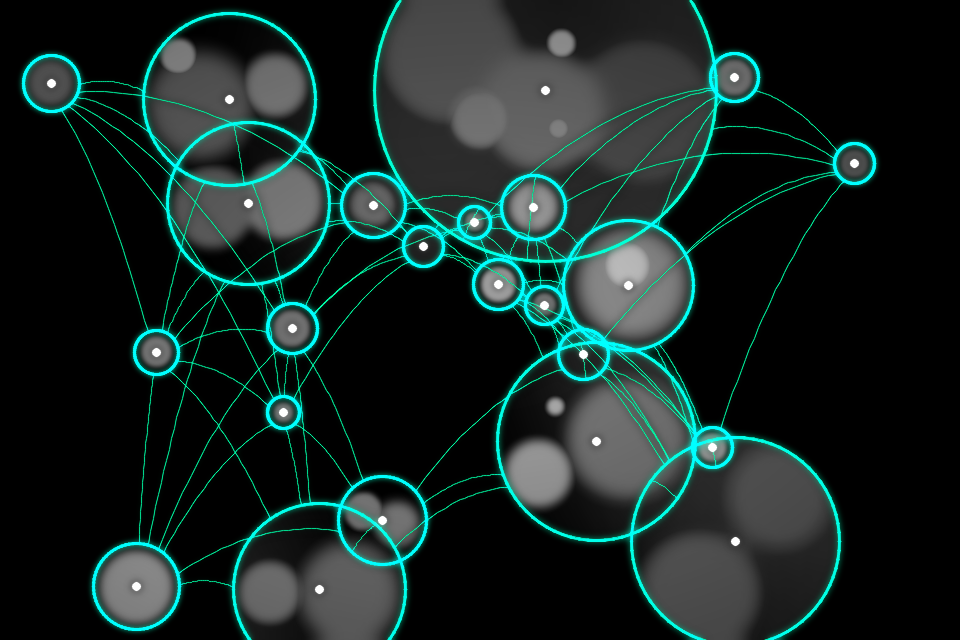
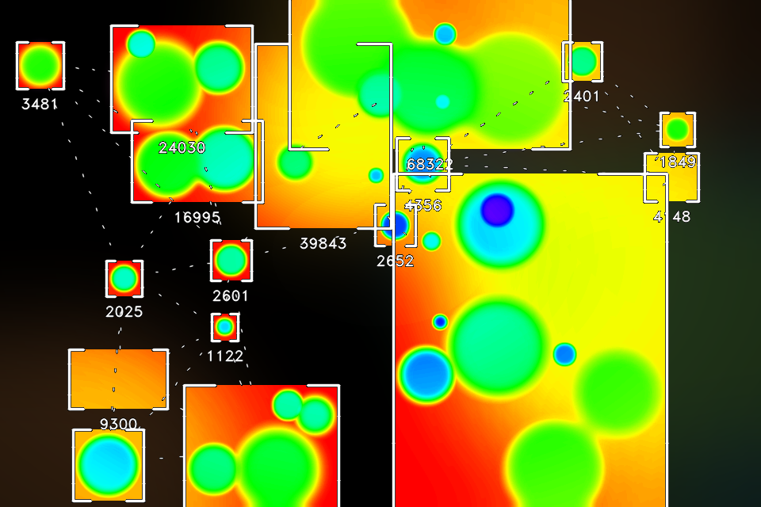
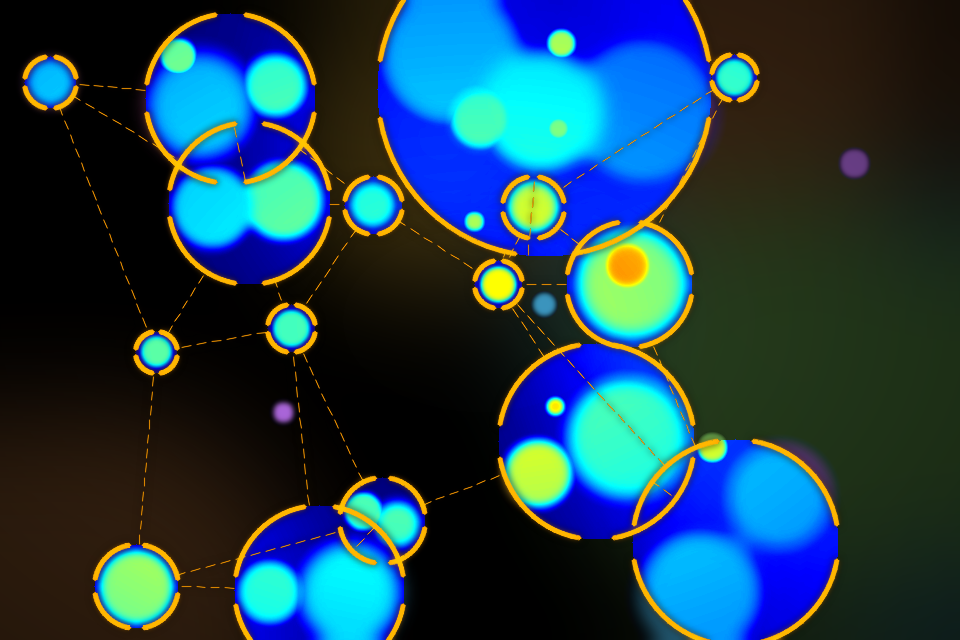

# 💠 BlobTrack Studio

Web app per **blob detection artistica**: carichi un'immagine (o un video, o la
webcam in diretta), l'app rileva forme e regioni con **OpenCV** lato server e le
ristila con contorni neon, wireframe, colormap e filtri creativi. Le creazioni si
salvano in una galleria personale e i preset di stile possono essere generati da
un **assistente AI**.

| Sorgente | Stile "wireframe" |
|---|---|
|  |  |
| **Stile "acid"** | **Stile "thermal"** |
|  |  |

<sub>Le quattro immagini sono generate dal motore dell'app: `venv/bin/python docs/demo/generate.py`</sub>

> 🌐 **Live demo:** _(aggiungi qui l'URL Render dopo il deploy, es. https://blobtrack.onrender.com)_

Progetto d'esame: applicazione web completa con **Python + Flask**.

---

## ✨ Funzionalità

- 🖼️ **Studio immagine** — upload → blob detection (color engine o YOLO) + styling completo: forme, wireframe, colormap interne, glow, etichette, ~60 parametri regolabili
- 🎬 **Video processing** — upload di un video → elaborazione frame-per-frame con tracker e scie di movimento → download MP4 (H.264)
- 🎵 **Audio reactivity** — aggiungi una traccia audio al video: beat detection e analisi RMS (librosa) modulano dimensioni, spessori e glow a tempo di musica; l'audio viene muxato nel file finale (ffmpeg)
- 📹 **Live cam** — la webcam del browser invia i frame al server via **WebSocket** (fallback HTTP automatico) e li riceve elaborati in near-real-time; scie e tracking **persistenti per stream** e **reattività al microfono** (WebAudio); snapshot salvabili in galleria
- 🗂️ **Galleria personale** — le creazioni salvate come record sul database, scaricabili
- 🎚️ **Preset di stile** — salva e riapplica le configurazioni, interscambiabili tra immagine, video e live
- 🤖 **AI Preset Generator** — descrivi un look a parole e l'AI (Groq) costruisce il preset
- 🔐 **Autenticazione completa** — registrazione, login, logout, eliminazione account (password hashate con `werkzeug.security`)
- 🍪 **Banner GDPR** — consenso al trattamento dati salvato sul database
- ⚠️ **Pagine d'errore custom** — 404, 500, 413
- 📱 **Design responsive** — design system "acid" con CSS custom properties, mobile-first

Due profili di installazione: **lite** (deploy, solo OpenCV) e **full** (locale: YOLO,
MediaPipe, reattività audio). L'app rileva le librerie presenti e adatta UI e motore da sola.

---

## 🛠️ Tech Stack

| Ambito | Tecnologie |
|--------|-----------|
| Backend | Python 3.11, Flask, Flask-SQLAlchemy, Flask-WTF |
| Database | SQLite (sviluppo) · PostgreSQL (produzione) |
| Computer vision | OpenCV (`opencv-contrib-python-headless`), NumPy, ultralytics (YOLO), MediaPipe |
| Audio | librosa (beat detection / RMS), ffmpeg (mux) |
| Template | Jinja2 (con template inheritance) |
| API esterna | Groq (LLM gratuito, endpoint OpenAI-compatibile) |
| Deploy | Gunicorn, Render |
| Test | pytest (34 test, capability-aware) |

---

## 🚀 Installazione locale

```bash
# 1. Clona il repository
git clone https://github.com/Filippo9991/blobtrack-studio.git
cd blobtrack-studio

# 2. Crea e attiva il virtual environment (Python 3.11)
python3.11 -m venv venv
source venv/bin/activate        # su Windows: venv\Scripts\activate

# 3. Installa le dipendenze — scegli il profilo:
pip install -r requirements-local.txt   # FULL: YOLO, MediaPipe, audio (~2GB, consigliato in locale)
#   oppure
pip install -r requirements.txt         # LITE: solo color detection (~260MB, come la demo online)

# 4. Configura le variabili d'ambiente
cp .env.example .env
#   genera una SECRET_KEY:  python -c "import secrets; print(secrets.token_hex(32))"
#   aggiungi la tua GROQ_API_KEY (gratuita su https://console.groq.com)

# 5. Avvia l'app
flask --app app run --debug
```

L'app è su http://127.0.0.1:5000. Il database SQLite viene creato automaticamente in `instance/`.

**L'app si adatta da sola al profilo installato** (`engine.capabilities()`): con il profilo
lite le sezioni YOLO/MediaPipe/audio spariscono dalla UI e il motore degrada con grazia —
nessuna configurazione manuale.

> Per avere l'audio nel video finale serve **ffmpeg** nel PATH (`brew install ffmpeg` /
> `apt install ffmpeg`); senza, il video viene comunque elaborato ma esce muto.

### Eseguire i test

```bash
pytest        # 34 test: auth, GDPR, studio, video (+audio, +limiti), live (+stream, +mic), engine, AI
```

La suite è capability-aware: i test che richiedono le dipendenze pesanti vengono
saltati automaticamente sul profilo lite (33 passed, 1 skipped).

---

## 🔑 Variabili d'ambiente

| Variabile | Descrizione |
|-----------|-------------|
| `SECRET_KEY` | Chiave segreta Flask (sessioni, CSRF) |
| `GROQ_API_KEY` | Chiave API Groq per l'AI Preset Generator |
| `GROQ_MODEL` | Modello LLM (default `llama-3.3-70b-versatile`) |
| `FLASK_ENV` | `development` · `production` · `testing` |
| `DATABASE_URL` | Solo in produzione: connection string PostgreSQL (fornita da Render) |

Nessun valore sensibile è committato: `.env` è nel `.gitignore`, ed è presente `.env.example`.

---

## ☁️ Deploy su Render (free tier)

Il repo include un [`render.yaml`](render.yaml) (Blueprint): **Dashboard → New → Blueprint →
collega il repo → Apply**. Crea da solo web service + PostgreSQL free già collegati; l'unica
variabile da inserire a mano è `GROQ_API_KEY`. Le tabelle vengono create automaticamente
all'avvio (`db.create_all()` idempotente).

Sulla demo free tier (512MB RAM, 0.1 CPU) gira il profilo **lite**: color detection completa,
galleria, preset, AI; l'elaborazione video è limitata a 15s / 480px (`VIDEO_MAX_*`), mentre
YOLO/MediaPipe/reattività audio sono funzioni della versione locale.

<details>
<summary>Deploy manuale (senza Blueprint)</summary>

1. Crea un database **PostgreSQL** (Free) e copia la *Internal Database URL*.
2. Crea un **Web Service** collegato a questo repository GitHub:
   - Build Command: `pip install -r requirements.txt`
   - Start Command: `gunicorn wsgi:app --workers 1 --threads 4 --timeout 300`
3. Imposta le **Environment Variables**: `SECRET_KEY`, `DATABASE_URL`, `GROQ_API_KEY`, `FLASK_ENV=production`.
</details>

---

## 📁 Struttura del progetto

Due package separati: `app/` (web) dipende da `engine/` (CV), mai il contrario.

```
wsgi.py                entrypoint produzione (gunicorn wsgi:app)
config.py              configurazione multi-ambiente (+ limiti video di produzione)
render.yaml            deploy one-click su Render (web service + PostgreSQL free)
requirements.txt       profilo LITE (deploy) · requirements-local.txt = profilo FULL

app/                   APPLICAZIONE WEB (Flask)
  __init__.py          application factory create_app() + error handlers
  extensions.py        istanza SQLAlchemy
  models.py            User, Creation, Preset
  forms.py             form Flask-WTF (config condivisa da Studio/Video/Live)
  decorators.py        @login_required
  blueprints/          main, auth, studio (immagine/video/live), live_ws (WebSocket), assistant
  services/            frame_engine (immagine/live), video_processing, ai_presets (Groq)
  templates/           Jinja2 (base + pagine + macro condivise, stile "acid")
  static/              CSS (design system), JS (live cam, campi condizionali)

engine/                MOTORE COMPUTER VISION (indipendente da Flask)
  __init__.py          API pubblica: ProcessingConfig, options, process_image_frame, run_video
  blob_engine.py       detection (color/YOLO/MediaPipe/silhouette/edge) + rendering
  frame_processor.py audio_processor.py signal_math.py schemas.py options.py
  models/              modelli MediaPipe (.task / .tflite)

docs/demo/             immagini del README + script che le rigenera
tests/                 suite pytest (31 test)
```

---

## ✅ Mappa dei requisiti d'esame

| # | Requisito | Dove |
|---|-----------|------|
| 1 | Stack: Flask, Flask-SQLAlchemy, SQLite in `instance/`, Jinja2, Flask-WTF, venv | `config.py`, `app/__init__.py`, `requirements.txt` |
| 2 | Autenticazione completa (register/login/logout/eliminazione) con hash `werkzeug.security` | `app/blueprints/auth.py`, `app/models.py` (`set_password`/`check_password`) |
| 3 | Cookie banner GDPR, consenso salvato su DB, non riappare | `app/templates/base.html`, `app/blueprints/main.py` (`/consent`), `User.cookie_consent` |
| 4 | Dati per-utente su DB (≥2 tipologie) | `Creation` (galleria) e `Preset` (configurazioni) in `app/models.py` |
| 5 | API esterna server-side con try/except, `timeout=5`, key in `.env`, `None` su errore | `app/services/ai_presets.py` (Groq) |
| 6 | Template inheritance, `{{ }}`, `for`/`if`, `url_for()` | `app/templates/` (tutti estendono `base.html`) |
| 7 | Form Flask-WTF: validators, `hidden_tag()`, errori nel template, `validate_on_submit()` | `app/forms.py`, template relativi |
| 8 | Flash messages con categorie CSS (`success`/`error`/`warning`) | `base.html` (`get_flashed_messages(with_categories=true)`) |
| 9 | `@login_required` con `functools.wraps` su dashboard/profile/dati personali | `app/decorators.py`, `app/blueprints/studio.py`, `auth.py` |
| 10 | ≥2 modelli in relazione, FK `nullable=False`, `unique` su username/email | `app/models.py` (User 1─* Creation, User 1─* Preset, cascade) |
| 11 | Error page custom 404 e 500 (con `db.session.rollback()`) | `app/__init__.py`, `templates/404.html`, `500.html` (+ `413.html`) |
| 12 | Nessun segreto nel codice: `.env` + `.env.example`, lettura da environment | `config.py`, `.env.example`, `.gitignore` |
| 13 | Repo GitHub pubblico, ≥5 commit significativi, `.gitignore` corretto | [github.com/Filippo9991/blobtrack-studio](https://github.com/Filippo9991/blobtrack-studio) |
| 14 | Responsive: viewport meta, media query, Flexbox/Grid | `base.html`, `app/static/css/style.css` (`@media (max-width: 860px)`) |
| 15 | Design system: CSS custom properties in `:root`, componenti con `var()` | `app/static/css/style.css` |
| 16 | Empty state con call-to-action dove non ci sono dati | `dashboard.html`, `presets.html` (`…`) |
